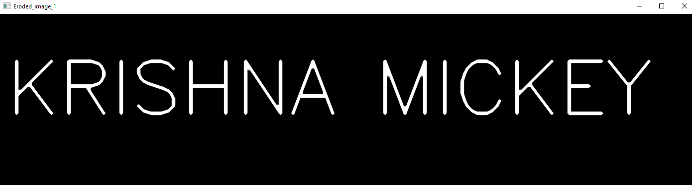

# Implementation-of-Erosion-and-Dilation
## Aim
To implement Erosion and Dilation using Python and OpenCV.
## Software Required
1. Anaconda - Python 3.7
2. OpenCV
# Algorithm:
## Step1:
Import necessary packages

## Step2:
Create a empty window and add text in it

## Step3:
create a structuring element

## Step4:
Do the operation

## Step5:
Show the output image

 
# Program:
## Import the necessary packages
```
import cv2
import numpy as np
```
## Create the Text using cv2.putText
```
img= np.zeros((350,1400),dtype ='uint8')
font = cv2.FONT_HERSHEY_SIMPLEX
cv2.putText(img,'KRISHNA MICKEY',(15,200),font,5,(255),10,cv2.LINE_AA)
cv2.imshow('created_text',img)
cv2.waitKey(0)
cv2.destroyAllWindows()
```

## Create the structuring element
### For Erosion
```
erode1= np.ones((5,5),np.uint8)
erode2 = cv2.getStructuringElement(cv2.MORPH_CROSS,(12,12))
```

## For Dilation
```
dilate1= np.ones((5,5),np.uint8)
dilate2 = cv2.getStructuringElement(cv2.MORPH_CROSS,(12,12))
```

## Erode and show the eroded image
```
image_erode1  = cv2.erode(img,erode1)
cv2.imshow('Eroded_image_1',image_erode1)
cv2.waitKey(0)
cv2.destroyAllWindows()


image_erode2  = cv2.erode(img,erode2)
cv2.imshow('Eroded_image_2',image_erode2)
cv2.waitKey(0)
cv2.destroyAllWindows()
```

## Dilate and show dilated the image
```
image_dilate1  = cv2.dilate(img,dilate1)
cv2.imshow('Dilated_image_1',image_dilate1)
cv2.waitKey(0)
cv2.destroyAllWindows()

image_dilated2  = cv2.dilate(img,dilate2)
cv2.imshow('Dilated_image_2',image_dilated2)
cv2.waitKey(0)
cv2.destroyAllWindows()

```


## Output:

### Display the Created Image


### Display the Eroded Image



### Display the Dilated Image


## Result
Thus the generated text image is eroded and dilated using python and OpenCV.
